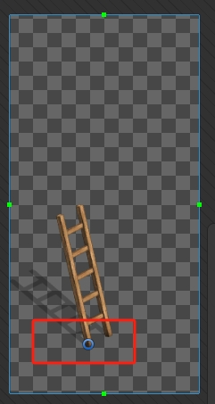

==== 设置 ====
Transparent Sort Axis
- 值: 0, 1, -0.26
- 如果是URP, 在2D Render Data设置
- 非URP, 在ProjectSettings设置

每张图都需要设置Pivot  

==== Tilemap ====
Z0:
- 地面层
- 地面碰撞层

Z4:
- 二楼层
- 二楼碰撞层

==== 参考链接 ====
https://blog.unity.com/engine-platform/isometric-2d-environments-with-tilemap
https://docs.unity3d.com/Manual/2DSorting.html?utm_source=evangelism&utm_medium=blog&utm_campaign=evangelism_global_generalpromo_43536-2dsortingdocs&utm_content=eva&aid=1011l3LoF&pubref=evangelism-blog-2dsortingdocs
https://docs.unity3d.com/Packages/com.unity.render-pipelines.universal@17.0/manual/2DRendererData-overview.html